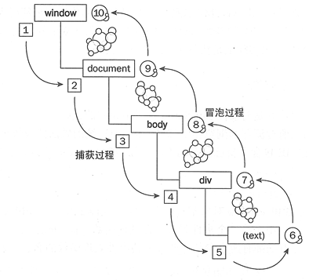
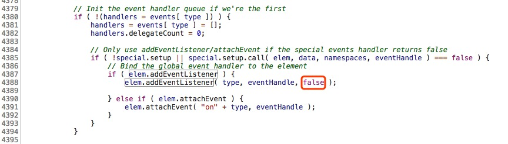
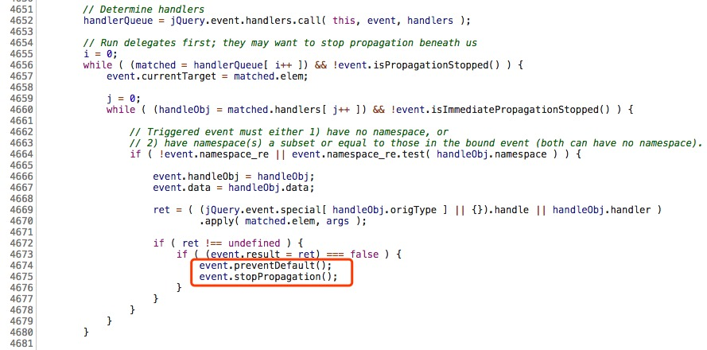

# JavaScript事件机制

### 先问几个问题，你是否能快速闪过答案？
1. 自下而上（冒泡）事件怎么写，自上而下（捕获）又是怎么写？
2. 捕获型和冒泡型同时存在，谁生效？
3. jquery的on或bind是冒泡，还是捕获？
4. 冒泡能够阻止，那捕获能够阻止吗？
5. stopPropagation 和 stopImmediatePropagation的区别
6. Event.bubbles，Event.eventPhase
7. Event.cancelable，Event.cancelBubble，event.defaultPrevented
8. 常用技巧

#### js事件的捕获和冒泡图


### 举个例子：
点击s2，s1分别会打印什么？

``` javascript
<div id="s1">s1
 <div id="s2">s2</div>
</div>
<script>
s1.addEventListener("click",function(e){ 
  console.log("s1 冒泡事件"); },false);
s2.addEventListener("click",function(e){ 
  console.log("s2 冒泡事件");},false);
s1.addEventListener("click",function(e){ 
  console.log("s1 捕获事件");},true);
s2.addEventListener("click",function(e){
  console.log("s2 捕获事件");},true);
</script>


//s1 捕获事件
//s2 冒泡事件
//s2 捕获事件
//s1 冒泡事件

```

<font color=orange>举个例子</font>

点击s2，click事件从document->html->body->s1->s2(捕获前进)这里在s1上发现了捕获注册事件，则输出<font color="#0099ff">"s1 捕获事件"</font>到达s2，已经到达目的节点。

s2上注册了冒泡和捕获事件，先注册的冒泡后注册的捕获，则先执行冒泡，输出<font color="#0099ff">"s2 冒泡事件"</font>

再在s2上执行后注册的事件，即捕获事件，输出<font color="#0099ff">"s2 捕获事件"</font>

下面进入冒泡阶段，按照s2->s1->body->html->documen(冒泡前进)
在s1上发现了冒泡事件，则输出<font color="#0099ff">"s1 冒泡事件"</font>


### jQuery的on事件是冒泡



## 常用技巧

> <font color=“#66d9ef”>onclick -->事件冒泡，重写onlick会覆盖之前属性，没有兼容性问题</font>

``` js
ele.onclik = null;   //解绑单击事件，将onlick属性设为null即可

```
> <font color=“#66d9ef”>阻止默认事件(href=""链接，submit表单提交等)</font>

1. **return false;** 阻止独享属性（通过on这种方式）绑定的事件的默认事件

	``` js
	ele.onclick = function() {
	    ……                         //你的代码
	    return false;              //通过返回false值阻止默认事件行为
	}
	```
	
	<table><td bgcolor = f6e5e5>
	<font size=5>但是</font>，在jQuery中，我们常用return false来阻止浏览器的默认行为，那”return false“到底做了什么？</br>
	
	当你每次调用”return false“的时候，它实际上做了<font size=4>3件事情：</font></br>
	
	<font size=4>
	
	* event.preventDefault();</br></br>
	
	* event.stopPropagation();</br></br>
	
	* 停止回调函数执行并立即返回。</br></br>
	
	</font>
	
	这3件事中用来阻止浏览器继续执行默认行为的只有preventDefault，除非你想要停止事件冒泡，否则使用return false会为你的代码埋下很大的隐患。</td></table>
	下面贴上jQuery的源码
	</br></br>
	
	
2. **event.preventDefault( );** 阻止通过 addEventListener( ) 添加的事件的默认事件
	
	``` js
	element.addEventListener(“click”, function(e){
	    var event = e || window.event;
	    ……
	    event.preventDefault( );      //阻止默认事件
	},false);
	
	```

3. **event.returnValue = false;** 阻止通过 attachEvent( ) 添加的事件的默认事件（此事件为ie浏览器特有）
	
	``` js
	element.attachEvent(“onclick”, function(e){
	    var event = e || window.event;
	    ……
	    event.returnValue = false;       //阻止默认事件
	},false);
	
	```

> <font color=“#66d9ef”>把事件绑定以及事件解绑封装成为一个函数，兼容浏览器，包括IE6及以上（虽然现在基本上都放弃了IE9以下了hhhh）</font>

``` js
// 事件绑定
function addEvent(element, eType, handle, bol) {
    if(element.addEventListener){           //如果支持addEventListener
        element.addEventListener(eType, handle, bol);
    }else if(element.attachEvent){          //如果支持attachEvent
        element.attachEvent("on"+eType, handle);
    }else{                                  //否则使用兼容的onclick绑定
        element["on"+eType] = handle;
    }
}

// 事件解绑
function removeEvent(element, eType, handle, bol) {
    if(element.addEventListener){
        element.removeEventListener(eType, handle, bol);
    }else if(element.attachEvent){
        element.detachEvent("on"+eType, handle);
    }else{
        element["on"+eType] = null;
    }
}

```


## 事件停止传播 stopPropagation 和 stopImmediatePropagation


``` js
// 事件传播到 element 元素后，就不再向下传播了
element.addEventListener('click', function (event) {
  event.stopPropagation();
}, true);

// 事件冒泡到 element 元素后，就不再向上冒泡了
element.addEventListener('click', function (event) {
  event.stopPropagation();
}, false);

```
但是，stopPropagation方法只会阻止<font color=“#66d9ef”>【该元素的当前事件（冒泡或者捕获）】</font>的传播，不会阻止该节点的其他click事件的监听函数。也就是说，不是彻底取消click事件,它还可以正常创建一个新的click事件。

``` js
element.addEventListener('click', function (event) {
  event.stopPropagation();
  console.log(1);
});

element.addEventListener('click', function(event) {
  // 会触发
  console.log(2);
});
```
如果想要彻底阻止这个事件的传播，不再触发后面所有click的监听函数，可以使用stopImmediatePropagation方法。
注意：是针对该事件，比如你在click里写了这个方法，那【使用该方法之后】的该元素上绑定的方法将失效，但是别的mousedown，mouseover方法等还是生效的。亲测过~

``` js
element.addEventListener('click', function (event) {
  // 会触发
  console.log(‘改方法内的可以执行’);
  event.stopImmediatePropagation();
  // 会触发
  console.log(1);
});

element.addEventListener('click', function(event) {
  // 不会被触发
  console.log(2);
});

// Jquery同理
$(element).click(function() {
  // 不会触发
  console.log(‘jquery click’)
})

$(element).hover(function() {
  // 会触发
  console.log(‘jquery click’)
})

```


## Event.bubbles，Event.eventPhase

**Event.bubbles**属性返回一个布尔值，表示当前事件是否会冒泡。该属性为只读属性，一般用来了解 Event 实例是否可以冒泡。前面说过，除非显式声明，Event构造函数生成的事件，默认是不冒泡的。可以根据下面的代码来判断事件是否冒泡，从而执行不同的函数。

``` js
function goInput(e) {
  if (!e.bubbles) {
    passItOn(e);
  } else {
    doOutput(e);
  }
}
```
专门查了一下不支持冒泡的事件有：

* UI事件（load, unload, scroll, resize）
* 焦点事件（blur, focus）
* 鼠标事件（mouseleave, mouseenter）


**Event.eventPhase**属性返回一个整数常量，表示事件目前所处的阶段。该属性只读。

``` js
var phase = event.eventPhase;
```
**Event.eventPhase**的返回值有四种可能。

* 0，事件目前没有发生。
* 1，事件目前处于捕获阶段，即处于从祖先节点向目标节点的传播过程中。
* 2，事件到达目标节点，即Event.target属性指向的那个节点。
* 3，事件处于冒泡阶段，即处于从目标节点向祖先节点的反向传播过程中。


## Event.cancelable，Event.cancelBubble，event.defaultPrevented

**Event.cancelable**属性返回一个布尔值，表示事件是否可以取消。该属性为只读属性，一般用来了解 Event 实例的特性。

大多数浏览器的原生事件是可以取消的。比如，取消click事件，点击链接将无效。但是除非显式声明，Event构造函数生成的事件，默认是不可以取消的。

``` js
var evt = new Event('foo');
evt.cancelable  // false
```

当Event.cancelable属性为true时，调用Event.preventDefault()就可以取消这个事件，阻止浏览器对该事件的默认行为。
注意，该方法只是取消事件对当前元素的默认影响，不会阻止事件的传播。如果要阻止传播，可以使用stopPropagation()或stopImmediatePropagation()方法。

``` js 
function preventEvent(event) {
  if (event.cancelable) {
    event.preventDefault();
  } else {
    console.warn('This event couldn\'t be canceled.');
    console.dir(event);
  }
}
```
**Event.cancelBubble**属性是一个布尔值，该属性可以自行设置。如果设为true，相当于执行Event.stopPropagation()，可以阻止事件的传播。

注意：MDN里说该特性已经从 Web 标准中删除，虽然一些浏览器目前仍然支持它，但也许会在未来的某个时间停止支持，请尽量不要使用该特性。请使用 event.stopPropagation() 方法来代替该不标准的属性.[cancelBubble-MDN](https://developer.mozilla.org/zh-CN/docs/Web/API/UIEvent/cancelBubble)

**Event.defaultPrevented**属性返回一个布尔值，表示该事件是否调用过Event.preventDefault方法。该属性只读。

``` js
if (event.defaultPrevented) {
  console.log('该事件已经取消了');
}
```


#### 主要参考文档：

[详解JS中的事件机制(带实例)](https://www.jianshu.com/p/7105b81e456a)

[事件模型](http://javascript.ruanyifeng.com/dom/event.html#toc24)